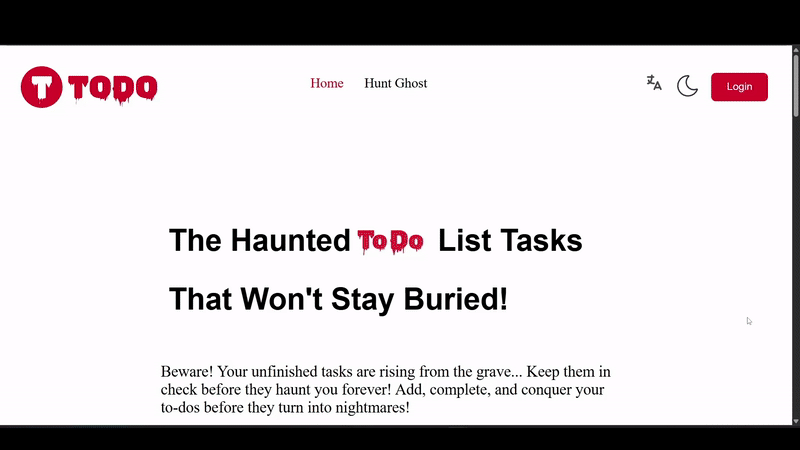
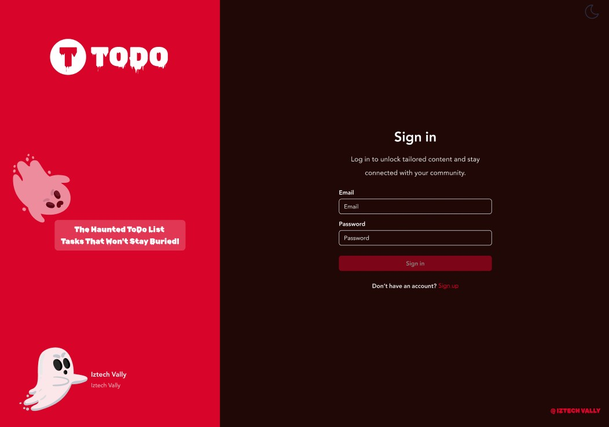
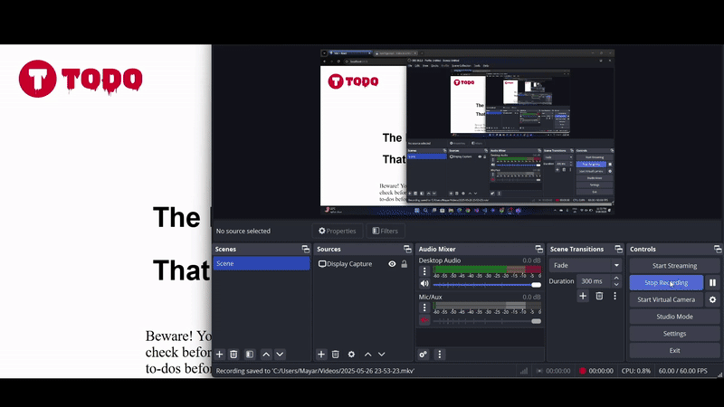
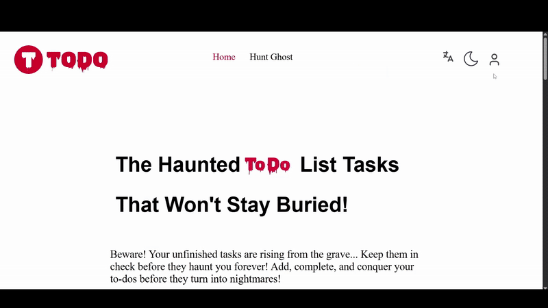
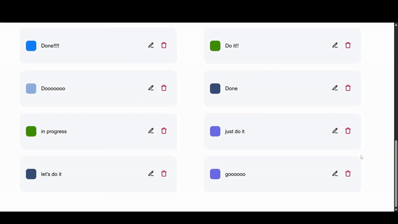

# To Do App

A simple web application to save your daily tasks so you don’t miss anything.

## Preview

### Landing Page  

### Sign In  

### Create a Task  

### Dark Mode  

### Change the Language to Arabic  

### Settings  

### Edit and Update a Status  

### Hunt the Ghost Game  

## Features

- login and signup  
- add, edit, and remove any task  
- display the tasks in a table  
- display a task in a grid  
- hunt the ghost game  
- update your name and password  
- add, edit, and remove any status  
- display the page in two languages: English and Arabic

## Technologies Used

- React.js  
- CSS  
- Axios  

## Setup Instructions

- cd Todo  
- npm install  
- npm run dev

